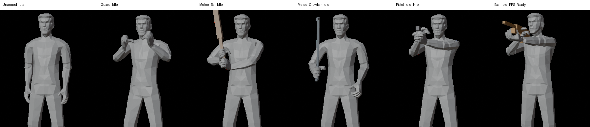
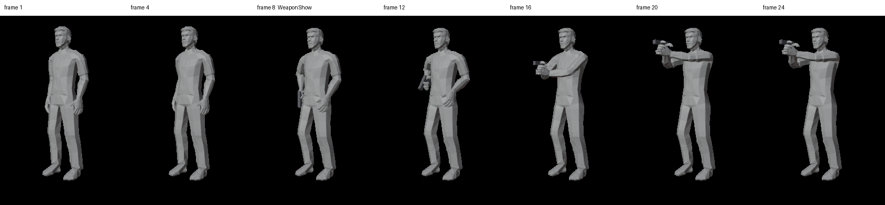
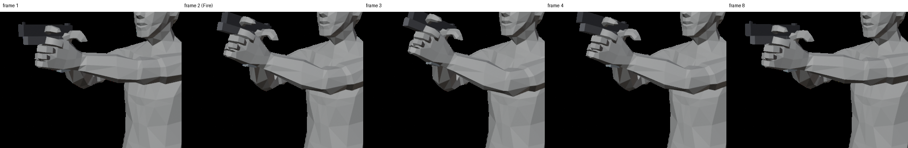
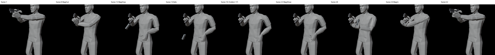

# Animatørguide – FPS-riggen

Fil: `Blender/FPS_Rig.blend`. Laget og testet i Blender 5.0, så bruk 5.0 eller nyere.

> **Ny i Blender? Start med tutorialen.** Åpne filen (kapittel 0) og gå til **N → FPS Rig → FPS Rig – Tutorial**. Den leder deg steg for steg gjennom en kroppsanimasjon («Huk og opp») og en våpenanimasjon («Pistol: sjekk sliden»), med grønn hake når et steg er gjort. Står du fast, gjør **Vis meg** steget for deg.

---

## 0. Første gang du åpner filen

1. Åpne `Blender/FPS_Rig.blend`. Figuren står i **Unarmed_Idle**, og ingen våpen er synlige.
2. Viser Blender en gul linje øverst om at Python-skript er blokkert, trykker du **Allow Execution**. Da får du verktøypanelet **FPS Rig**.
   - Gikk den linja forbi: åpne **Scripting**-fanen, velg `fps_rig_tools.py` i tekstredigereren og trykk **Run Script**.
   - Vil du slippe dette hver gang: **Edit → Preferences → Save & Load → Auto Run Python Scripts**.
3. I 3D-vinduet trykker du **N** og velger fanen **FPS Rig** til høyre.
4. Velg riggen og gå til **Pose Mode** (Ctrl+Tab).

Riggen virker fint uten panelet. Panelet gir disse snarveiene:
- **Action-boksen:** Start/End for klippet (tidslinjen følger automatisk), **Fit to keys**, **Match End to Start** og **Select: All / Body / Fingers / Weapon**.
- **Weapon for this Action:** hvilket våpen klippet bruker. Det vises automatisk.
- **Adjust Grip:** hvordan våpenet sitter i hånden, ett grep per våpen (kapittel 5.1).
- **Make / Update Weapon Rig:** rigger et nytt våpen (kapittel 8).
- **Switch Follow (keep pose):** bytter Follow uten at noe hopper.
- **Eksport:** klipp og våpenmodell, med valg av **Body** og/eller **Weapon**. **Export Character Model** lager figuren til Unity-avataren.
- **FPS Rig – Tutorial:** interaktiv øving for nybegynnere.

**Animation-fanen** øverst i Blender er ferdig oppsatt: den lille 3D-visningen viser FPS-kameraet, den store viser hele figuren, og Dope Sheet står i Action Editor. Det er den beste fanen å animere i.

---

## 1. Startposene (Actions)

Hver animasjon er en **Action** i Blender og blir én FBX-fil i Unity. Disse følger med:

| Action | Hva | Våpen | Loop |
|---|---|---|---|
| `Unarmed_Idle` | Står avslappet med armene ned og puster | – | 60 frames |
| `Guard_Idle` | Knyttnever oppe, lett sving og pust | – | 60 frames |
| `Melee_Bat_Idle` | Balltre med to hender ved skulderen | Bat | 60 frames |
| `Melee_Crowbar_Idle` | Brekkjern i høyre hånd, venstre hånd avslappet | Crowbar | 60 frames |
| `Pistol_Idle_Hip` | Pistol med to hender, sikter framover (ferdig loop fra `Source/Animations/pistol_idle_loop_fit.glb`, overført til kontrollene) | M1911 | 50 frames |
| `Pistol_Draw` | Fra idle trekkes pistolen, og klippet ender i `Pistol_Idle_Hip` | M1911 | nei, 24 frames |
| `Pistol_Fire` | Skudd fra hofta: avtrekkeren glir bak, hammeren faller, sliden går bak (spenner hammeren) og fram, rekyl, lite kamerarykk | M1911 (animert) | nei, 12 frames |
| `Pistol_Reload` | Magasinet glir ut langs grepet og faller, nytt magasin fra venstre hofte, inn, tilbake i grepet | M1911 (animert) | nei, 52 frames |
| `Example_FPS_Ready` | Rifle klar | Rifle | nei |

**Våpen vises automatisk.** Hver Action husker hvilket våpen den bruker, og velger du en Action, vises riktig våpen.
- **Bytte våpen for en Action:** FPS Rig-panelet → **Weapon for this Action**.
- **Uten panelet:** i Outliner åpner du samlingen **Weapons** og klikker øye-ikonet på våpenets samling.
- **Riggede våpen (`WPN_`):** delene kan animeres (slide, avtrekker, magasin), og våpenet får sitt eget klipp i Unity. M1911 (fra 3ds Max) og en plassholder-hagle følger med som eksempler.
- **Enkle referanser (`REF_`):** står stille i hånden. Det gjelder rifle, balltre, brekkjern og nøkkel.

---

## 2. Lage en ny animasjon

1. Bytt et av vinduene nederst til **Dope Sheet** og sett modusen til **Action Editor**.
2. Velg startposen som ligner mest i Action-menyen (f.eks. `Pistol_Idle_Hip` for et pistolskudd).
3. Trykk **duplikat-knappen** ved siden av navnet. Du får en kopi som `Pistol_Idle_Hip.001`.
4. Gi den nytt navn, f.eks. `Pistol_Fire_Hip`. **Navnet blir klippnavnet i Unity.**
5. Trykk **skjold-ikonet (Fake User)**, så Blender aldri sletter den.
6. Lager du en animasjon som spilles én gang, altså ikke en loop: i **Graph Editor** velger du alle kanaler (A) og trykker **Shift+E → Clear Cyclic (F-Modifier)**. Idle-posene loopes i Blender, men kopien skal ikke det.
7. Sett lengden i FPS Rig-panelet: huk av **Manual Range** og skriv **Start** og **End**, f.eks. 1–20. Tidslinjen følger etter, og eksporten bruker dette området. **Fit to keys** setter området til første og siste nøkkel.
8. Animer kontrollene og sett nøkler med **I**. Hold deg til 30 fps.
9. Sjekk resultatet i **FPS-visning** (Numpad 0) og i full kropp: velg `External_View` og trykk Ctrl+Numpad 0, eller roter fritt i vinduet.
10. Skal klippet ende der det startet (tilbake til idle): gå til siste frame og trykk **Match End to Start**. Posen fra første frame kopieres og nøkles på siste frame, for de valgte kontrollene eller for alle hvis ingen er valgt.
11. Eksporter (kapittel 7) og lagre `.blend`-filen.

**Velge mange kontroller:** **Select: All / Body / Fingers / Weapon** setter figuren og våpenet i Pose Mode samtidig og velger gruppen. Nyttig for å nøkle alt (I), kopiere en hel pose (Ctrl+C, og Ctrl+V på en annen frame) eller bruke Match End på bare én gruppe.

**Reset av en pose:** velg kontrollene og trykk **Alt+G** (posisjon) og **Alt+R** (rotasjon).

---

## 3. Kontrollene

Bare de fargede formene er ment å animeres. Gul er kroppen, blå er venstre, rød er høyre, grønn er fingrene, oransje er våpenet og lilla er kameraet.

| Hva du vil | Ta tak i |
|---|---|
| Flytte hele karakteren | `CTRL_Root` (stor sirkel på gulvet). La den stå i origo for klipp som skal stå på stedet |
| Flytte kroppen eller gå ned i huk | `CTRL_Torso` (boksen ved hoftene). Flytt ned, og føttene blir stående |
| Vippe eller svinge bekkenet | `CTRL_Hips` (bare rotasjon) |
| Bøye eller vri overkroppen | `CTRL_Spine`, `CTRL_Chest`, `CTRL_UpperChest` |
| Se rundt | `CTRL_Neck`, `CTRL_Head` |
| Trekke på skuldrene | `CTRL_Shoulder.L/R` (roter X) |
| Flytte våpenet og høyre hånd som holder det | `CTRL_Weapon` (oransje boks langs løpet) |
| Plassere hendene | `CTRL_Hand_IK.L/R` (boks rundt hånden) |
| Rette albuene | `CTRL_Elbow_Pole.L/R` (diamanter bak albuene) |
| Plassere føttene | `CTRL_Foot_IK.L/R` (plate under foten, roterer rundt ankelen) |
| Bøye tærne | `CTRL_Toe.L/R` |
| Rette knærne | `CTRL_Knee_Pole.L/R` (diamanter foran knærne) |
| Animasjonskamera | `CTRL_Camera` (kamera-ikon ved øynene) |

Verdiene i sidepanelet (N → Item) er ekte meter og grader. Posisjonene er målt i forhold til der kontrollen «hører hjemme», så tallene kan se store ut, f.eks. −1.5 m på en hånd som følger våpenet. Det er normalt.

### Fingre (grønne)

| Kontroll | Roter X | Roter Z |
|---|---|---|
| `CTRL_Grip.L/R` (streken over knokene) | Knyttneve: bøyer alle fire fingre (ytterste ledd litt mindre, som en ekte knyttneve) | Vifte: +Z sprer fingrene, −Z samler dem. Likt på begge hender |
| `CTRL_Index/Middle/Ring/Pinky.L/R` | Bøyer den fingeren (alle tre ledd) | Flytter fingeren sidelengs ved knoken |
| `CTRL_Thumb.L/R` | Bøyer tommelen **over** håndflaten mot lillefingeren | **+Z** løfter tommelen ut fra håndflaten, **−Z** legger den rundt et håndtak. Likt på begge hender |

- Positiv X lukker og negativ X åpner, på begge hender.
- Alt legges sammen. Grip X 65 og Index X −45 gir for eksempel en avtrekkerfinger som er nesten rett mens resten holder grepet.
- Finjustering: slå på bein-samlingen **Finger Detail** (Armature-egenskaper → Bone Collections). Den gir én liten sirkel per ledd.
- **Typiske verdier:**
  | Grep | Grip X | Thumb X | Thumb Z |
  |---|---|---|---|
  | Knyttneve (tommel foran fingrene) | 85 | 25 | 0 |
  | Rundt et håndtak (pistol, balltre) | 70–82 | 50–55 | −50 til −60 |
  | Avslappet hånd | 20 | 10 | 0 |
- Grip over omtrent 85° presser fingertuppene inn i håndflaten på denne low-poly-modellen.

---

## 4. Follow-sliderne, og hvorfor hånden kan hoppe

Velg kontrollen. Slideren står i **FPS Rig**-panelet og i N → Item → Properties.

| Kontroll | Slider | 0 | 1 |
|---|---|---|---|
| `CTRL_Hand_IK.R` | Follow Weapon | Høyre hånd er fri | Høyre hånd bæres av `CTRL_Weapon` |
| `CTRL_Hand_IK.L` | Follow Weapon | Venstre hånd er fri | Venstre hånd blir på våpenet (slik det sitter i høyre hånd) |
| `CTRL_Weapon` | Follow Chest | Våpenet står i ro når kroppen beveger seg | Våpenet følger overkroppen |
| `CTRL_Camera` | Follow Head | Kameraet beveger seg bare når du animerer det | Kameraet følger hodet |

**Hvorfor hånden hopper når du drar slideren:** Hånden lagrer posisjonen sin *i forhold til* det den følger. Bytter du fra «våpenet» til «rommet», brukes de samme tallene fra et nytt utgangspunkt, og hånden havner et annet sted. Riggen er ikke ødelagt.

**Løsningen:** bruk knappen **Switch Follow (keep pose)** i FPS Rig-panelet:
1. Gå til framen der byttet skal skje, f.eks. der venstre hånd slipper våpenet for å ta et nytt magasin.
2. Velg kontrollen, f.eks. `CTRL_Hand_IK.L`.
3. Trykk **Switch Follow (keep pose)**. Slideren bytter, hånden blir stående, og alt nøkles automatisk: den gamle verdien på framen før og den nye på denne framen.

Startposene har sliderne ferdig nøklet, så hver Action husker sine egne verdier.

---

## 5. Våpen og verktøy

Våpenet sitter i **høyre hånd**, med **ett grep per våpen**, på samme måte som det festes til høyre hånd i Unity. Det du ser i Blender, er det du får i spillet. Grepet justerer du i 5.1.

- **`WPN_Attach`** (tom med piler) er festepunktet. Origo er grepspunktet, Z-pila peker langs løpet (eller den «farlige enden»), og Y-pila peker opp.
- **Animere våpenet i hånden:** flytt og roter `CTRL_Weapon`. Høyre hånd følger, og våpenet følger høyre hånd.
- **Sitter våpenet feil i hånden?** Juster grepet: se 5.1.
- **Animere delene** (slide, avtrekker, magasin) på et rigget våpen: se kapittel 8.4. Delene animeres i **samme Action** som kroppen.
- **Høyre Follow Weapon = 0:** animer `CTRL_Hand_IK.R` direkte (fint for nærkampslag). Våpenet følger fortsatt hånden, men `CTRL_Weapon` gjør da ingenting.
- **Uten våpen:** sett Weapon for this Action = Unarmed og Follow Weapon = 0 på begge hender.
- **Nytt våpen med bevegelige deler:** kapittel 8.
- **Nytt våpen uten bevegelige deler** (balltre, nøkkel osv.):
  1. Importer det.
  2. Velg våpenet, Shift-klikk `WPN_Attach`, og trykk **Ctrl+P → Object (Keep Transform)**.
  3. Flytt og roter *våpenet* til grepet ligger i origo og løpet peker langs Z-pila.
  4. Legg det i en egen samling `REF_<Navn>` under **Weapons**, så dukker det opp i våpenmenyen.
- Ikke støttet i v1: å gi våpenet over til venstre hånd.

### 5.1 Juster grepet (hvordan våpenet sitter i hånden)

Eksempel: pistolen skal sitte bedre i hånden i `Pistol_Draw`.

1. Velg Actionen `Pistol_Draw` og gå til en frame der pistolen vises (frame 8 eller senere).
2. FPS Rig-panelet → Weapon-boksen → **Adjust Grip**. En oransje boks rundt våpenet blir valgt.
3. **G** flytter og **R** roterer, til våpenet sitter godt. Se gjerne gjennom FPS-kameraet (Numpad 0) og fra siden. Høyre hånd står stille, og venstre hånd følger våpenet.
4. Trykk **Done**. Grepet gjelder nå **alle klipp med dette våpenet**, men ingen andre våpen. **Reset Grip** går tilbake til standard.
5. Juster fingrene til slutt. Det gjøres **per klipp** med `CTRL_Grip.R`, `CTRL_Thumb.R` og `CTRL_Index.R`. Trykk **I** på alle framene med håndnøkler (i `Pistol_Draw`: 8, 12, 16, 20 og 24), ellers glir grepet tilbake mellom nøklene.
6. **Rigget våpen** (f.eks. M1911): trykk **Export Weapon Model** på nytt, så får Unity det nye grepet. Klippene trenger ikke eksporteres på nytt for grepets skyld.

**Godt å vite:**
- Ser du ikke **Adjust Grip**, har Actionen ikke noe våpen. Velg et under **Weapon for this Action**.
- Trykk **Done** før du bytter Action eller våpen, ellers går endringen tapt.
- Grepet animeres aldri. Det lagres i `Blender/weapon_grips.json`, så commit den fila sammen med `.blend`-fila.

---

## 6. Oppskrifter

**Bruk alltid `FPS_View` (Numpad 0) når du lager FPS-poser.** Korset midt i kamerabildet er der spillets siktekors er.

### Trekke våpen (se `Pistol_Draw`)
1. Start fra posen til `Unarmed_Idle`: dupliser `Pistol_Draw` eller `Unarmed_Idle` og fjern loopen (Shift+E).
2. Sett **Follow Weapon = 0 på høyre hånd** for hele klippet, og animer høyre hånd til holsteret og opp.
3. Legg en markør der våpenet skal dukke opp, f.eks. når hånden er ved hofta:
   - I Action Editor slår du på **Show Pose Markers**. Den ligger i View-menyen eller Marker-menyen, avhengig av Blender-versjonen.
   - Trykk **M** på framen, og gi markøren navnet `WeaponShow` (F2).
   - **Skjul våpenet frem til da:** velg våpenets `CTRL_Root` (stor boks rundt hele våpenet). Sett skala til 0 (S 0, I) på første frame og skala 1 på `WeaponShow`-framen. Skalaen bytter momentant og blir med til Unity, så våpenet er skjult der også.
4. Venstre hånd kommer opp. På framen der den griper, trykker du **Switch Follow** på `CTRL_Hand_IK.L` (0 → 1).
5. Avslutt i nøyaktig samme pose som idle-posen klippet skal gå over i, f.eks. `Pistol_Idle_Hip`.

### Holstre
- Lag trekkanimasjonen baklengs: dupliser den, velg alle nøkler i Dope Sheet, sett tidslinjen midt i klippet, og velg **Key → Mirror → By Times Over Current Frame**. Juster deretter timingen.
- Markøren heter `WeaponHide`, og settes der våpenet er tilbake i hofta.

### Sikte fra hofta og ADS (ironsight/kikkert)
- Lag posene **i vater** (se rett fram). Spillet bøyer ryggraden i kode når spilleren ser opp eller ned.
- **Hofte:** løpet skal peke mot korset i `FPS_View`, og våpenet synes nede til høyre.
- **ADS:** flytt `CTRL_Weapon` til bakre og fremre sikte (eller kikkerten) ligger rett over korset i `FPS_View`. Kameraet står stille, så du flytter våpenet til øyet og ikke øyet til våpenet.

### Skudd og rekyl (se `Pistol_Fire`)
- **Frame 1–2:** avtrekkeren trykkes (`CTRL_Trigger`, roter X), og en markør `Fire` settes på skuddframen.
- **Sliden** (`CTRL_Slide`, flytt langs løpet) går bak på skuddframen og fram 2 frames senere.
- **Rekyl:** våpenet sparkes litt bakover og opp med `CTRL_Weapon`, og går deretter 6–10 frames tilbake til utgangsposen.
- **Valgfritt kamerarykk:** en liten rotasjon på `CTRL_Camera` (1–2°). Den legges oppå spillerens kamera i Unity.

### Lading (se `Pistol_Reload`)
1. Venstre hånd slipper våpenet: velg `CTRL_Hand_IK.L` og trykk **Switch Follow** (1 → 0).
2. Magasinet (`CTRL_Magazine`) glir ut av grepet og faller. Sett markøren `MagOut` når det løsner og `MagDrop` når det er fri av våpenet. Der kan Unity slippe et fysisk magasin.
3. Når det har falt ut av bildet, skaler du det til 0 (S 0, I). Det er skjult til det nye magasinet skal vises, og skjulingen blir med i Unity-klippet.
4. Hånden henter et nytt magasin ved hofta. Der velger du `CTRL_Magazine`, setter **Follow Left Hand** = 1, skala 1, og plasserer magasinet i hånden. Sett markøren `MagShow`.
5. Hånden fører magasinet inn. Når det sitter, trykker du **Switch Follow** på `CTRL_Magazine` (1 → 0), så det blir sittende i våpenet. Sett markøren `MagIn`.
6. Hånden tilbake på grepet: **Switch Follow** på `CTRL_Hand_IK.L` (0 → 1).

Samme oppskrift gjelder hagle (Shell i stedet for Magazine, én gang per patron), SMG og rifle.

### Nærkamp (balltre eller brekkjern)
- Balltre: begge hender følger. Animer `CTRL_Weapon` gjennom slaget og vri overkroppen (`CTRL_Torso`, `CTRL_Chest`).
- Brekkjern: venstre hånd er fri (Follow 0).
- Treffet: et lite kamerarykk på `CTRL_Camera` er valgfritt.

### Interaksjon: vri om nøkkel
- Vis `REF_Key`. Høyre Follow Weapon = 1 og venstre = 0.
- Roter `CTRL_Weapon` rundt sin egen Y-akse, som går langs nøkkelbladet. Bøy fingrene med `CTRL_Thumb.R` og `CTRL_Index.R`.

### Kamera i animasjon
- Vanlige klipp: ikke rør `CTRL_Camera`. Da får spilleren full kontroll.
- Kamerarykk (treff, rekyl) og cutscenes: animer `CTRL_Camera`. Bruk **Follow Head** = 1 når kameraet skal følge hodet, f.eks. når man blir slått ned.
- Om et klipp *styrer* kameraet eller bare *legger til* bevegelse, bestemmes i Unity.
- `FPS_View` viser det nøytrale spillkameraet pluss det du animerer. Det viser ikke huk-høyden eller musebevegelsen fra spillet.

### Ser du innsiden av hodet i FPS-visningen?
- Kameraet står inne i hodet. Filen har **Backface Culling** slått på, så innsiden ikke tegnes.
- Er den slått av i ditt vindu: Viewport Shading-pila (øverst til høyre i 3D-vinduet) → Options → **Backface Culling**.
- I spillet skjules hodet vanligvis for førstepersonskameraet.

### Overkroppsklipp
- Klipp som skal spilles oppå Mixamo-gange (våpenposer, skudd, lading, trekk): **ikke flytt `CTRL_Torso` eller `CTRL_Root`.** Bare overkropp, armer og hode tas med i Unity.

---

## 7. Eksport til Unity

**FPS Rig-panelet → Export this Action** (eller **Export all Actions**).

Knappene **Body** og **Weapon** over eksportknappene velger hva som lages: begge (vanlig), bare kroppsklippet (f.eks. når du bare har endret kroppen), eller bare våpenklippet.

Dette skjer når du trykker:
1. Den aktive Actionen spilles av frame for frame i Action-ens frame-område, med 30 fps.
2. Mixamo-skjelettet (65 bein) og `AnimCamera` bakes, altså hver frame lagres som ren beinbevegelse.
3. Alt det andre blir igjen i Blender: kontroller, mesh og kameraer.
4. Resultatet (med **Body** på) skrives til **`Exports/<Action-navn>.fbx`**: **kun skjelett, uten skin**, akkurat som «Without Skin» fra Mixamo.
5. **Bruker Actionen et rigget våpen** og **Weapon** er på, lages også et våpenklipp: **`Exports/Weapons/<Våpen>/WPN_<Våpen>@<Action>.fbx`**. Det inneholder bare våpenets bein (slide, magasin osv.), målt i forhold til våpenets grep.
6. **Export all Actions** gjør det samme for alle Actions i filen.
7. **Export Weapon Model** (i Weapon-boksen) lager **`Exports/Weapons/<Våpen>/WPN_<Våpen>.fbx`**: våpenets deler og bein i hvilestilling, med grepet, til prefaben i Unity. Kjør den på nytt når modellen eller grepet endres.
8. **Export Character Model** lager **`Exports/Character/LowPolyGuy.fbx`**: den skinnede figuren i hvilestilling, til Humanoid-avataren i Unity. Kjør den på nytt når figuren byttes.

**I Unity** gjør du det samme som med Mixamo-animasjoner:
1. Dra FBX-filen inn i prosjektet.
2. Under **Rig** velger du Animation Type **Humanoid**, Avatar Definition **Copy From Other Avatar** og avataren fra `Exports/Character/LowPolyGuy.fbx` (se `Docs/UNITY_INTEGRATION.md` §0). Trykk **Apply**.
3. Under **Animation** heter klippet det samme som Actionen. Huk av **Loop Time** for idle-klippene.
4. Markørene (`WeaponShow`, `MagDrop` osv.) blir ikke med automatisk. Skjuling med skala 0 blir derimot med i klippene. Legg den inn som en **Animation Event** på samme frame (se `Docs/UNITY_INTEGRATION.md`).

**Våpen i Unity:** importeres som **Generic**, ikke Humanoid. Se `Docs/UNITY_INTEGRATION.md` §7.

**Manuell eksport** (uten panelet): velg bare riggen og gå til File → Export → FBX med disse innstillingene: Selected Objects, Object Types = Armature, **Apply Scalings = FBX Units Scale**, Forward −Z, Up Y, **Only Deform Bones** på, **Add Leaf Bones** av, Bake Animation på, NLA Strips av, All Actions av, Simplify 0.

---

## 8. Nytt våpen: modellere, rigge, animere

Dette virker for alle våpentyper: pistol, SMG, rifle, pumpehagle, knekkhagle, revolver, boltrifle. Du modellerer bare delene, gjerne i 3ds Max, og riggen lages i Blender med én knapp.

### 8.1 Modellere (3ds Max eller Blender)

| Regel | Hvorfor |
|---|---|
| Grepspunktet (der høyre håndflate sitter på grepet) i **origo** | Da havner våpenet riktig i hånden |
| Løpet peker mot **−Y**, altså mot deg i Front-visning. Opp = +Z | Max og Blender har samme Front |
| **Hver bevegelig del er et eget objekt** | Hver del får sitt eget bein |
| **Pivot (origo) i dreie- eller glidepunktet**, f.eks. avtrekkerens aksling eller magasinets topp | Delen roterer eller glir rundt riktig punkt |
| Pivoten rettet etter verden (standard) | Glidedeler glir da langs løpet, og roterende deler roterer rundt sideaksen |
| Navn: **`<Våpen>_<Del>`**, f.eks. `M1911_Frame`, `M1911_Slide`, `M1911_Magazine` | Våpennavnet og bevegelsestypen hentes fra navnet |
| Hoveddelen heter **`_Frame`**, **`_Body`** eller **`_Receiver`** | Den er fast og bærer resten |
| Valgfritt: tomme objekter (Max: *Dummy/Point*) **`<Våpen>_Muzzle`** og **`<Våpen>_Eject`** | Festepunkter for munningsflamme og hylser i Unity |
| Valgfritt hierarki: lenk en del til delen den sitter på (Max: *Link*), f.eks. `Rifle_BoltHandle` → `Rifle_Bolt` | Riggen bruker samme hierarki |

**Delnavn som gir bevegelse automatisk** (kan endres etterpå):

| Bevegelse | Navn som inneholder | Kontrollen kan |
|---|---|---|
| Glir | Slide, Bolt, Pump, Forend, ChargingHandle, Carrier | flyttes langs løpet |
| Roterer | Trigger, Hammer, Safety, Selector, Lever, Cylinder, Hinge, Break, Stock, Sight, Latch, Release, BoltHandle | roteres rundt sideaksen (X) |
| Løs del | Magazine, Mag, Shell, Clip, Grenade, Round, Ammo | flyttes fritt og følge venstre hånd (**Follow Left Hand**) |
| Fri | alt annet | flyttes og roteres fritt |

**Roterer en del rundt en annen akse** (revolvertrommel, sammenleggbar kolbe, knekkløp)? Roter pivoten slik at pivotens X er dreieaksen. Eller velg aksen i panelet etterpå (8.3).

**Eksport fra 3ds Max:**
1. Velg delene.
2. Kjør **Reset XForm** (Utilities) på dem, og deretter Convert to Editable Poly.
3. Velg **File → Export Selected → FBX**: enhet **Centimeters**, **Y-up** (Max sin standard). Ingen animasjon, kamera eller lys.

Det trengs ingen bein i Max.

**Ferdige animasjoner** (f.eks. en GLB eller FBX laget på denne karakteren) legges i **`Source/Animations/`**. Byggeskriptet overfører dem til kontrollene med `sample_clip()` + `pose_from_world()`, slik at de kan redigeres videre i Blender og eksporteres som vanlige klipp. Kravet er at klippet er laget på det samme Mixamo-skjelettet.

**Hvor fila skal ligge:** i **`Source/Weapons/`**, f.eks. `Source/Weapons/M1911.fbx`. Aldri i `Exports/`: den mappa er for filer riggen lager, og **Export Weapon Model** skriver `Exports/Weapons/<Våpen>/WPN_<Våpen>.fbx`.

**Eksempel: M1911.** Originalen fra Max ligger i `Source/Weapons/M1911_original_max.fbx`. `Blender/scripts/prepare_m1911.py` lager den ferdige `Source/Weapons/M1911.fbx`: navn `M1911_*`, avtrekker og hammer skilt ut fra rammen, magasinpivot på toppen og vippet 12° etter grepet, og Muzzle/Eject lagt til. Fila kan åpnes i Max og jobbes videre med.
- Neste gang du eksporterer fra Max: ha **avtrekker** (`M1911_Trigger`) og **hammer** (`M1911_Hammer`) som egne objekter med pivot i akslingen. Legg **magasinpivoten øverst på magasinet**, rotert etter grepsvinkelen, så magasinet glir langs brønnen.
- Pistolens **høyre side er −X** i Max (løpet mot −Y). Utkastervinduet og `_Eject` ligger der.
- Modellen er omtrent 10 % større enn en ekte M1911 (24 cm lang mot 21,6 cm). Endre det i Max hvis det ikke er meningen.

### 8.2 Rigge (Blender)
1. I `FPS_Rig.blend`: **File → Import → FBX**. Delene havner i origo.
2. Velg **alle** delene til våpenet, også Muzzle og Eject.
3. FPS Rig-panelet: trykk **Make / Update Weapon Rig**.
4. Ferdig. Du får `WPN_<Våpen>`:
   - et bein per del,
   - en farget kontroll-boks rundt hver bevegelig del: `CTRL_Slide`, `CTRL_Trigger`, `CTRL_Magazine` …,
   - våpenet festet i høyre hånd,
   - en egen samling under **Weapons**.

**Ny versjon av modellen** (endret i Max): importer på nytt, velg delene og trykk **Make / Update Weapon Rig** igjen.
- Beina flyttes til de nye pivotene, og de gamle delene byttes ut.
- **Animasjonene dine beholdes**, fordi delene har samme navn.

### 8.3 Justere bevegelse
- **`CTRL_Root`** (stor boks rundt hele våpenet) skjuler våpenet: skala 0 = skjult, 1 = synlig. Brukes i trekk og holster.
- **Løse deler** (magasin, patron) kan også skaleres til 0 for å skjules.
- Velg en våpenkontroll i Pose Mode. Panelet viser **Motion: …**. Trykk på den for å velge type (Slide / Rotate / Detachable / Free) og akse.
- Det settes som vanlige lås-ikoner i N → Item, så du kan også slå dem av og på der.

### 8.4 Animere våpenet sammen med kroppen
1. Velg en Action, og sett **Weapon for this Action** til våpenet (f.eks. M1911).
2. Velg både karakteren og våpenriggen: trykk **Select: Weapon** i FPS Rig-panelet (eller klikk `Armature` og Ctrl-klikk `WPN_M1911` i Outliner og gå til **Pose Mode** med Ctrl+Tab). Nå kan du ta tak i kontrollene på begge.
3. Animer kropp og våpendeler på samme tidslinje. Alt havner i **samme Action**: våpenet har sin egen «slot» i den.
4. **Dope Sheet** (modus *Dope Sheet*) viser nøklene for begge. Action Editor viser bare det aktive objektet.
5. Dupliserer du Actionen, får våpenet automatisk kopien.

### 8.5 Eksportere
- **Export this Action:** karakterklippet og våpenklippet.
- **Export Weapon Model:** våpenmodellen til prefaben, én gang og ved modellendringer.

---

## 8b. Ny figur

Riggen bygges fra figuren i `Source/Characters/` (nå `LowPolyGuy_T_Pose.fbx`). En annen Mixamo-rigget figur kan tas inn slik:
1. Last ned fra Mixamo med skin, i T-pose (FBX). Størrelsen spiller ingen rolle, for figuren skaleres til 1,75 m.
2. Legg den i `Source/Characters/` og sett `SRC` øverst i `Blender/scripts/build_fps_rig.py`.
3. Kjør byggeskriptet. Kontrollene, kameraet ved øynene, våpnene, startposene og pistol-idle-loopen lages på nytt for figuren.
4. Eksporter klippene og **Export Character Model**, og lag en ny avatar i Unity (`Docs/UNITY_INTEGRATION.md` §0).

Animasjoner du har laget i en eksisterende `.blend` blir ikke flyttet automatisk. Eksporter dem først. I Unity spilles de av på den nye figuren via Humanoid.

---

## 9. Begrensninger og tips

- **Foten roterer rundt ankelen.** Det finnes ikke hæl- eller tåpivot. For å løfte hælen roterer du foten og flytter den ned. For tåhev bøyer du også `CTRL_Toe`.
- **Knærne er hengsler:** de bøyer bare framover. Vil du ha knærne innover eller utover, flytter du `CTRL_Knee_Pole` til siden.
- **Helt rette bein** kan få knærne til å «poppe». Behold en liten bøy.
- **Flytter du `CTRL_Root`, flytter føttene seg også.** Bruk `CTRL_Torso` for å flytte kroppen med føttene på plass.
- **Ikke flytt, gi nytt navn til eller endre forelder på bein i Edit Mode.** Mixamo-skjelettet må være identisk for Unity.
- **La de skjulte bein-samlingene `Deform (Mixamo)` og `Mechanism` være skjult.**
- **Riggen bygges fra kilde-FBX-en med `Blender/scripts/build_fps_rig.py`.** Det trengs bare hvis selve riggen skal endres. Animasjonene dine i en eksisterende fil blir ikke med automatisk.

---

## 10. Arbeidsflyt-tips

- **Animation-fanen:** FPS-kameraet til venstre, hele figuren til høyre. Se mest i kameravisningen, for det er det spilleren ser.
- **Blocking først:**
  1. Sett ytterposene først, f.eks. magasin ut og magasin inn.
  2. Hold en pose noen frames ved å kopiere nøklene (Shift+D i Dope Sheet).
  3. Vis posene som trinn: velg alle nøkler, **T → Constant**.
  4. Når timingen sitter: **T → Bezier**, og finpuss i Graph Editor. Velg nøkler og **S X** for å strekke eller korte inn timingen.
- **Liv i bevegelsen:**
  - Forskyv timingen litt. La f.eks. hånden starte et par frames før våpenet.
  - Gi våpenet en liten dupp når det brukes kraft (magasin ut eller inn, slide).
  - Legg inn en liten «wiggle» eller settle på slutten i stedet for et hardt stopp.
  - La magasinet «lete» litt før det glir inn.
  - Bytt grep på magasinet mellom ut og inn, så det ser ut som et nytt magasin.
  - Ha pekefingeren av avtrekkeren under lading og trekk.
- **Tilbake til idle:** **Match End to Start** på siste frame. Spill av i loop og sjekk at det ikke hopper.
- **Motion Paths:** velg hånden eller våpenet, og velg **Pose → Motion Paths → Calculate**. Da ser du banen og kan glatte ut hakk.
- **Kamera:** grove nøkler på `CTRL_Camera` som følger våpenet, ryddet i Graph Editor. Hold det subtilt, med små rykk på magasin ut og inn. Det justeres uansett etter test i spillet.
- **Våpenet i bildet:** til høyre og litt lavt, så det ikke dekker siktekorset i `FPS_View`.
- **Lagre versjoner:** **File → Save Incremental** (eller en git-commit) før store endringer.
