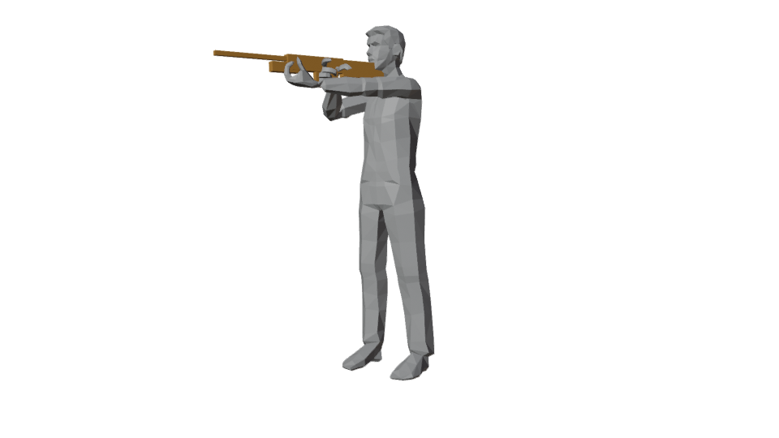
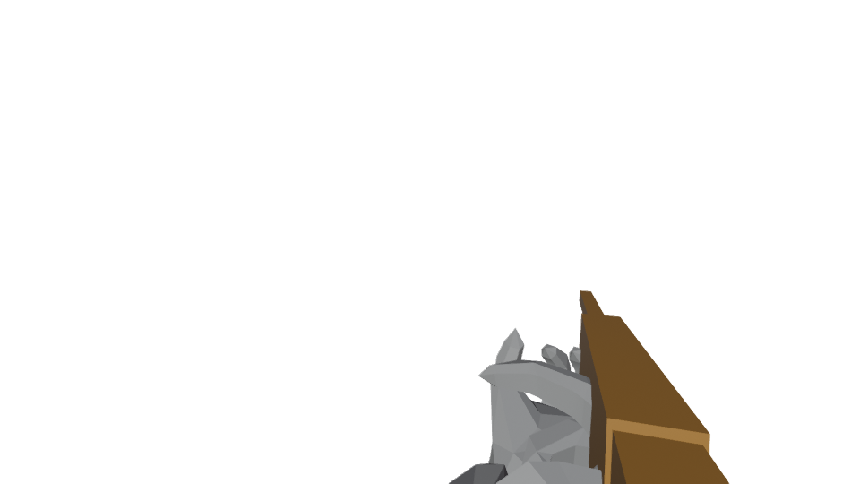

# Animator Guide – FPS Rig

File: `Blender/FPS_Rig.blend` – built and tested with Blender 5.0; use 5.0 or newer.

## Start a new animation

1. Open `Blender/FPS_Rig.blend`. It opens on the Action **Example_FPS_Ready** (rifle ready pose).
2. Select the rig, go to **Pose Mode**.
3. In the **Dope Sheet → Action Editor**, click the *duplicate* button next to the Action name to start from the ready pose, or **New** to start from scratch. Give it the clip name you want in Unity (e.g. `Rifle_Reload`).
4. Click the shield icon (Fake User) so Blender never discards it.
5. Set the clip length in the Action's **Manual Frame Range** (Action properties) – export uses this range. 30 fps.

## Controls

Only the coloured shapes are meant to be animated. Yellow = body, blue = left, red = right, green = fingers, orange = weapon, purple = camera.

| What you want | Grab |
|---|---|
| Move whole character | `CTRL_Root` (big circle on the floor) – keep at origin for in-place clips |
| Crouch / shift weight | `CTRL_Torso` (box at the hips) – move down, feet stay planted |
| Swing pelvis only | `CTRL_Hips` |
| Bend / twist upper body | `CTRL_Spine`, `CTRL_Chest`, `CTRL_UpperChest` |
| Look around | `CTRL_Neck`, `CTRL_Head` |
| Shrug | `CTRL_Shoulder.L/R` |
| Place hands | `CTRL_Hand_IK.L/R` (box around the hand) |
| Aim elbows | `CTRL_Elbow_Pole.L/R` (diamonds behind the elbows) |
| Place feet | `CTRL_Foot_IK.L/R` (flat plate under the foot) |
| Bend toes | `CTRL_Toe.L/R` |
| Aim knees | `CTRL_Knee_Pole.L/R` (diamonds in front of the knees) |
| Weapon / tool | `CTRL_Weapon` – the hands follow it |
| Animation camera | `CTRL_Camera` (camera-shaped icon at the eyes) |

### Fingers (green)

| Control | Rotate X | Rotate Z |
|---|---|---|
| `CTRL_Grip.L/R` (bar above the knuckles) | whole-hand fist (4 fingers) | – |
| `CTRL_Index/Middle/Ring/Pinky.L/R` | curl that finger | spread |
| `CTRL_Thumb.L/R` | curl thumb | spread / opposition |

Positive X closes the hand, negative opens it. For fine detail, show the **Finger Detail** bone collection: one small circle per joint, added on top of the curl.

### Sliders (select the control, see **N panel → Item → Properties**)

| Control | Slider | 0 | 1 |
|---|---|---|---|
| `CTRL_Hand_IK.L/R` | Follow Weapon | hand stays in place | hand moves with the weapon (default) |
| `CTRL_Weapon` | Follow Chest | weapon stays in place | weapon moves with the upper body (default) |
| `CTRL_Camera` | Follow Head | camera only moves when you animate it (default) | camera also follows the head |

Set these once per Action. They can be keyed, but switching mid-animation makes the hand/weapon jump unless you counter-animate it.

## Weapons and tools

- `REF_Weapon` is a placeholder rifle. Import your real weapon/tool model, then parent it to the rig with **Ctrl+P → Bone** while `CTRL_Weapon` is the active bone. Hide the placeholder.
- Unarmed or interaction clips: set **Follow Weapon** to 0 on both hands.
- One-handed tools / melee: set the free hand to 0, keep the holding hand at 1 and animate `CTRL_Weapon`.
- The weapon is not exported. In Unity it attaches to the right-hand bone as usual.

## Camera

- `FPS_View` (scene camera) looks through the animation camera. Numpad 0 to view through it. `External_View` is a full-body camera (select it, Ctrl+Numpad 0).
- Leave `CTRL_Camera` untouched for normal clips – no camera movement is exported (offset stays zero).
- Animate it only for deliberate camera moments: melee impact shake, recoil kick, takedowns, knockdown/get-up, scripted interactions.
- In Unity the gameplay camera stays player-controlled; this bone is added as an *offset* on top.
- Tip: enable **Backface Culling** in the viewport shading options to avoid seeing the inside of the head in FPS view.

## Export to Unity

1. Make sure the Action you want is active on the rig.
2. **Scripting** workspace → Text Editor → select `export_action_to_unity.py` → **Run Script** (Alt+P).
3. The file appears at `Exports/<ActionName>.fbx`: the Mixamo skeleton + `AnimCamera`, baked, no control bones.

Manual alternative: select only the rig, **File → Export → FBX** with: Selected Objects, Object Types = Armature, Apply Scalings = FBX Units Scale, Forward −Z, Up Y, **Only Deform Bones** on, **Add Leaf Bones** off, Bake Animation on, NLA Strips off, All Actions off, Simplify 0.

### Unity import

- Rig: **Humanoid**, Avatar Definition: **Copy From Other Avatar** → the existing Mixamo character avatar.
- Animation tab: the clip is named after the Action. Check Start/End frames match the Action range.
- Camera offset: to receive `AnimCamera`, the character in Unity needs a transform at the same path and the clip's **Mask → Transform** must include it (see Docs/RIG_PLAN.md §4).

## Reset / tips

- Reset a pose: select controls, **Alt+G / Alt+R** (clear location/rotation).
- Don't move, rename or re-parent bones in Edit Mode – the Mixamo skeleton must stay identical for Unity.
- Hidden bone collections **Deform (Mixamo)** and **Mechanism** are for the rig internals; leave them hidden.
- Rebuilding the rig from the source FBX: `Blender/scripts/build_fps_rig.py` (only needed if the rig itself must change; Actions in an existing file are not carried over automatically).
