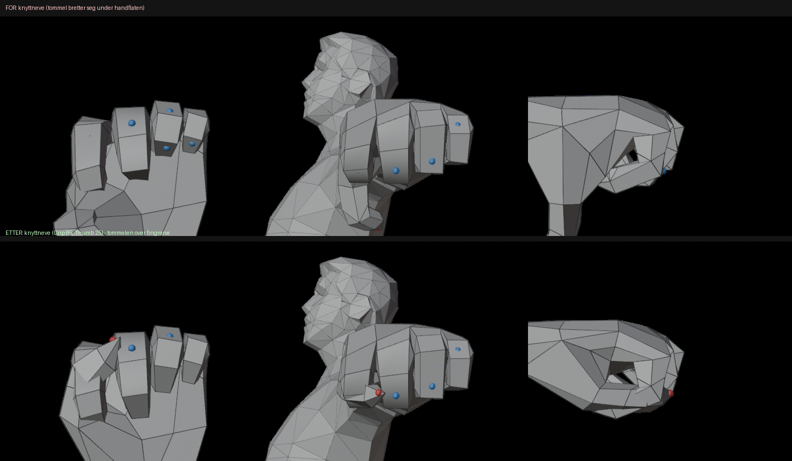

# Rig Review – production readiness

Focused review of `Blender/FPS_Rig.blend` before calling it production-ready. Verdict: **Blender side ready; production sign-off waits on the Unity checks at the end.**

## 1. Camera hierarchy (AnimCamera)

**Kept top-level** (child of the `Armature` root node, sibling of `Hips`). Alternatives considered:

| Option | Gameplay offset | Cutscene ownership | Inherited motion |
|---|---|---|---|
| Child of `Head` | offset must be reconstructed by removing head motion; Humanoid retargeting changes the head pose in Unity | camera follows head always | breathing, head bob, retarget differences |
| Child of `Hips` | same problem with hip motion | – | locomotion bob |
| **Top-level (current)** | curve *is* the offset (identity at rest) | curve is a complete character-space camera pose | **none** unless **Follow Head** is chosen |

Verified in the exported FBX: rest rotation identity relative to the character root (+Z forward, +Y up), position (0, 1.645, 0.07) m. Head-following is opt-in and baked only when chosen. Added to docs: the offset/ownership formulas, the crouch-preview limitation, and the **root-motion caveat** (the camera curve contains body travel; Unity applies root motion to the GameObject, so camera-owned clips that use root motion need the script to subtract it, or stay in-place).

## 2. Armature scale 0.01 / rotation X 90°

- The object transform is how Blender represents a Y-up centimetre FBX; it cancels on export (the `Armature` node exports with zero rotation). **Kept.**
- **Fixed:** the first export wrote a **0.01-scaled `Armature` node**. Interim fix was *All Local* export; final fix (v1.1): the rig build applies the 0.01 scale, so the rig works in real metres (sidebar values are metres, not mislabelled cm) and *FBX Units Scale* export writes metre units with an unscaled `Armature` node and the same Hips transform as the source. Mesh deformation verified identical (≤ 4 µm). Only remaining structural difference: the extra identity `Armature` node (Humanoid maps by bone name; verify in Unity).

## 3. Weapon / hand IK / runtime attachment

- **Fixed conflict:** the weapon used to sit on `CTRL_Weapon` while the right hand only chased it with IK. Any right-hand offset or reach limit made Blender's weapon disagree with a runtime right-hand socket (the example pose itself had this).
- Now: hidden bone `WPN_Socket` rigidly on `mixamorig:RightHand`, plus a visible `WPN_Attach` empty for weapon models. `CTRL_Weapon` carries the right hand; the left hand follows the socket. Socket axes: +Z barrel, +Y up, pivot at the grip. Unity local values documented in RIG_PLAN §5.
- Assumption to confirm: runtime attaches weapons to the right-hand bone. Not supported: weapon hand-overs / left-hand weapons.

## 4. Fingers

| Check | Result |
|---|---|
| Curl (X) | same direction on both hands; 3 joints equal; additive with grip and detail controls (no double transform – verified 60+20 = 80° etc.) |
| Spread | **was misleading:** per-finger Z shifts the finger sideways and is mirrored between hands. **Added** Grip Z fan spread (index/middle toward thumb, ring/pinky away; +Z opens on both hands). Per-finger Z documented as sideways/visual |
| Thumb | **was misdocumented:** X = curl toward/across the palm (opposition direction), Z = spread toward/away from the index. **Fixed** unnatural "thumb points down" fist: metacarpal now gets half the curl (30/60/60) |
| Extremes | Grip > ~85° pushes fingertips into the palm (low-poly mesh) – documented |

### 4b. Hand closing review (v1.4)

| Check | Result |
|---|---|
| Finger bone roll | **OK** – local X is the hinge (⊥ palm normal and finger) within 0.1–0.3° on all fingers, both hands; +X curls toward the palm |
| Joint placement | **OK** – every joint sits inside the finger, centred between back and palm side; along the finger the joints lie between the (one-per-segment) edge loops with blended weights. Moving bones would change the Mixamo rest pose / Unity Avatar, so they stay |
| **Thumb** | **Fixed.** Mixamo gives the thumb the same roll as the fingers, so thumb X folded it down and back under the palm (X 45°: tip 12 cm toward the wrist, only 4.7 cm across). The thumb controls now have a roll aimed across the palm (target between the middle/ring knuckles, 2 cm palm-side); `MCH_Thumb1–3` (deform roll, children of the controls) hand the rotation to the untouched deform bones. X 45° now moves the tip 12 cm across the palm. Thumb Z is now the same on both hands (+ away from the palm, − wraps around a handle) |
| **Grip distribution** | **Changed** from 1/1/1 to 1/1/0.7 (knuckle / middle / tip joint): Grip 85 = 85/85/60°, fewer fingertips in the palm |
| Start poses | Thumb values re-tuned (pistol, bat, crowbar, rifle, guard fist, magazine release); no thumb penetrates a weapon mesh. Deform rest pose unchanged (≤ 0.05°) |

## 5. Foot IK (v1 limits, documented)

No heel/toe roll pivots or roll slider (foot pivots at the ankle); no knee-pop softening near full extension; moving `CTRL_Root` moves the feet. Fine for v1; heel/toe roll is the first upgrade worth doing.

## 6. Other fixes

- `CTRL_Hips` location locked: translating it moved the deform upper body away from the spine/head controls. Body translation is `CTRL_Torso`'s job.
- IK pole angles solved with a more robust search.
- Docs: precision claims corrected (rest pose matches within 0.05° – float32 level – not "0.0000°"), "spread/opposition" wording, weapon/camera behaviour, Unity assumptions marked as assumptions.

## 7. Follow-up (v1.1)

- Follow Weapon = 0 made the arm jump: expected space-switch behaviour (keys are relative to the followed space). Added the *Switch Follow (keep pose)* tool; start poses key the sliders per Action (before, a slider changed in one Action leaked into all others).
- Sidebar showed "−152.9 m" for what was centimetres: fixed by building the rig in metres (see §2).
- Added start poses, `Pistol_Draw` test animation, weapon references, centre cross in `FPS_View`, Norwegian step-by-step animator guide and `UNITY_INTEGRATION.md`.

## 8. Weapon rigs (v1.2)

- Verified: bone pivots exact; slide locked to the barrel axis; same rig from parts with FBX-import-like transforms (rot X 90°, scale 0.01) and from an FBX round trip; Update moves pivots, replaces old parts and keeps animation; Follow Left Hand switch without jump; Action sync on switch/duplicate; weapon model FBX unrotated/unscaled with 6 bones + 4 meshes; weapon clip round trip 0 mm; character clips unchanged (66 bones, no weapon).
- Not verifiable here: a real 3ds Max FBX (test with the first real export).

## Open – needs the Unity project

1. Import `Exports/Pistol_Draw.fbx` and `Pistol_Idle_Hip.fbx` as Humanoid (*Copy From Other Avatar*) and check the poses.
2. Compare `AnimCamera` rest with the current neutral FPS camera.
3. Confirm the right-hand weapon socket convention and values.
4. Implement camera offset / cutscene ownership (RIG_PLAN §4), including the root-motion rule.
